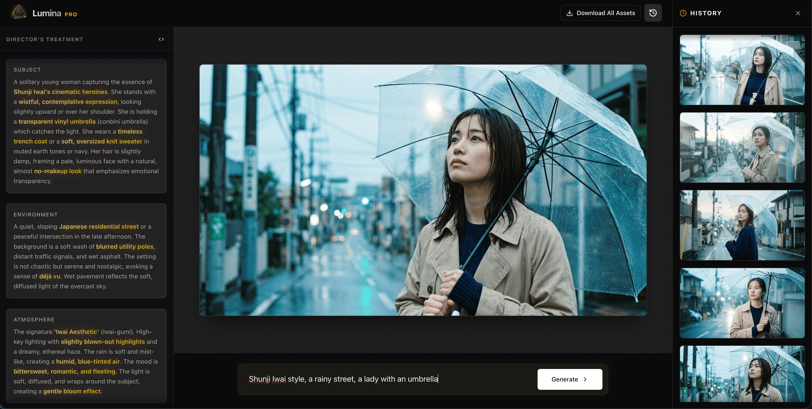
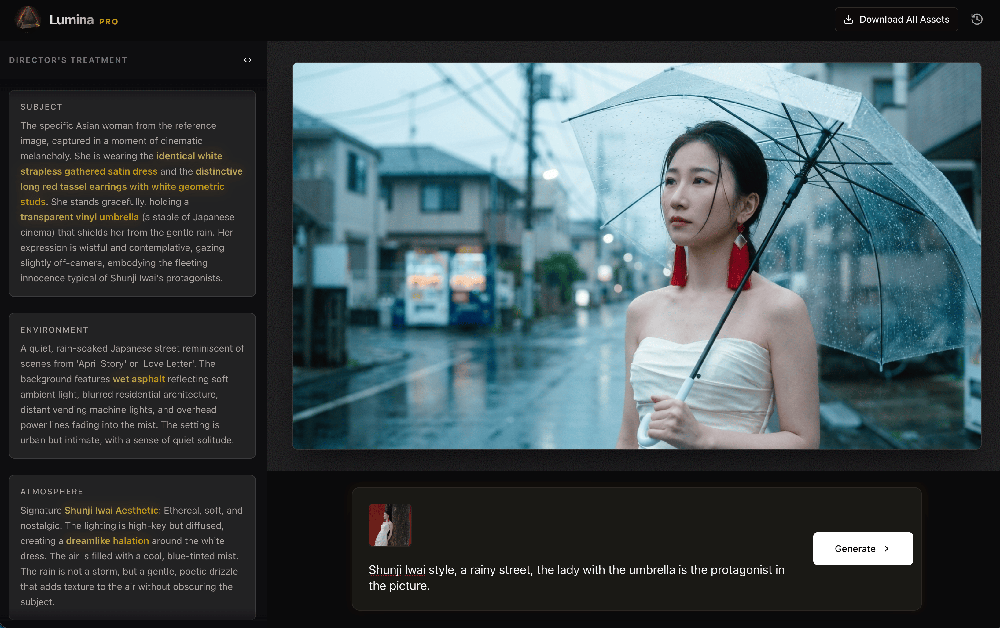

<div align="center">
  
</div>

# Lumina PRO

**AI-Powered Cinematic Prompt Engineering**

[English](./README.md) | [简体中文](./README_zh-CN.md)



Lumina PRO is a sophisticated tool designed to transform simple concepts into highly detailed, premium-quality image generation prompts. It leverages the power of Google's Gemini 3.0 Pro model to act as a virtual visual director, expanding your ideas with cinematic lighting, composition, and technical specifications.

## Features

-   **Intelligent Prompt Expansion**: Converts brief inputs into comprehensive "Director's Treatment" prompts.
-   **Reference Image Support**: Upload up to 5 reference images to guide the style, composition, and lighting.
    
-   **Cinematic Visualization**: Generates high-fidelity previews using Gemini's image generation capabilities.
-   **History & Management**: Automatically saves your creations with options to regenerate, delete, or download.
-   **Bulk Export**: Download all your generated assets (images and JSON prompts) in a single ZIP file.
-   **Fullscreen View**: Immersive viewing experience for generated images.
-   **Secure Architecture**: Server-side API handling ensures your API keys remain private.

## Tech Stack

-   **Framework**: [Next.js 14+](https://nextjs.org/) (App Router)
-   **Language**: TypeScript
-   **Styling**: [Tailwind CSS 4](https://tailwindcss.com/)
-   **Runtime**: [Bun](https://bun.sh/)
-   **AI Model**: Google Gemini 3.0 Pro (`gemini-3-pro-preview` & `gemini-3-pro-image-preview`)
-   **UI Components**: Shadcn UI, Lucide React, Framer Motion

## Getting Started

### Prerequisites

-   [Bun](https://bun.sh/) installed.
-   A Google Gemini API Key.

### Installation

1.  **Clone the repository:**

    ```bash
    git clone <repository-url>
    cd lumina
    ```

2.  **Install dependencies:**

    ```bash
    bun install
    ```

3.  **Configure Environment Variables:**

    Copy the example environment file and add your API key:

    ```bash
    cp .env.example .env
    ```

    Edit `.env` and set your `GEMINI_API_KEY`:

    ```env
    GEMINI_API_KEY=your_actual_api_key_here
    ```

4.  **Run the Development Server:**

    ```bash
    bun run dev
    ```

    Open [http://localhost:3000](http://localhost:3000) in your browser.

## Docker Support

Build and run the containerized application:

```bash
# Build the image
docker build -t lumina-pro .

# Run the container (passing the API key)
docker run -p 3000:3000 -e GEMINI_API_KEY=your_key_here lumina-pro
```

## License

MIT
